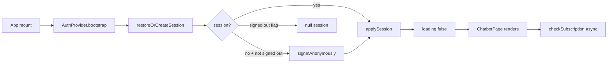
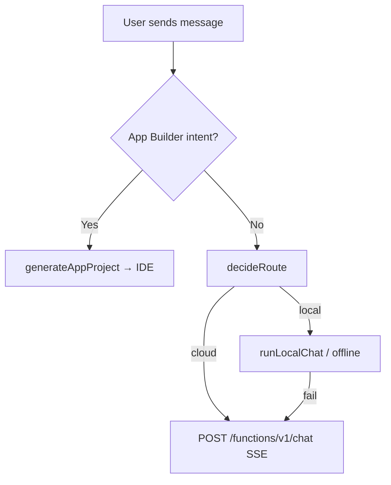
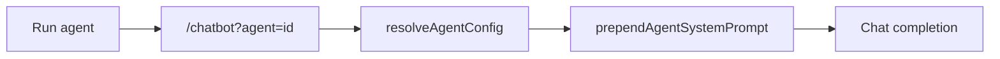

# Architecture reference

## Top-level structure

```
/workspace
├── src/
│   ├── pages/              # Route screens
│   ├── components/         # UI (chat/, landing/, pricing/, ui/, …)
│   ├── hooks/              # React hooks
│   ├── lib/                # Business logic (offline, marketplace, auth, …)
│   ├── contexts/           # React contexts
│   └── integrations/       # ShadowTalk backend client
├── backend/
│   ├── functions/          # Edge functions
│   └── migrations/         # SQL
├── Detailed Documentation/ # Engineering docs
├── DOCUMENTATION.md        # Master doc index
└── public/llms.txt         # LLM crawler summary
```

---

## Primary routes (2026)

| Path | Page | Notes |
|------|------|-------|
| `/` | Redirect | → `/chatbot` |
| `/chatbot` | `ChatbotPage` | **Default product**; `?agent=`, `?conversation=`, `?q=` |
| `/home` | `Index` | Marketing landing |
| `/pricing` | `PricingPage` | Standalone pricing UX |
| `/ide` | `IdePage` | PersonalIDE, session payload |
| `/marketplace` | `MarketplacePage` | Agents |
| `/missioncontrol` | `MissionControlPage` | Autonomous missions |
| `/auth` | `AuthPage` | Sign-in; redirect if already authenticated |

**Full list:** [11-complete-route-reference.md](./11-complete-route-reference.md)

---

## Auth & session



| Module | Role |
|--------|------|
| `persistentAuth.ts` | Session restore, anonymous login, sign-out flag |
| `AuthProvider.tsx` | React context |
| `skipBootScreen.ts` | Skip `BootScreen` on `/`, `/chatbot` |
| `PersistedAuthRedirect.tsx` | Auth page guard |

---

## Data stores

| Store | Technology | Examples |
|-------|------------|----------|
| Auth & DB | ShadowTalk backend | `conversations`, `messages`, `user_installed_agents` |
| Session | `sessionStorage` | IDE payload, boot flag `shadowtalk-booted` |
| Local | `localStorage` | Hardware profile, auth storage key, sign-out flag |

---

## Chat completion flow



**UI:** `ChatInput` (composer layout) → `ChatbotPage.handleSendMessage` → `runChatCompletion`.

---

## Marketplace agent flow



---

## Key environment variables

| Variable | Purpose |
|----------|---------|
| `VITE_SUPABASE_URL` | API + functions base |
| `VITE_SUPABASE_PUBLISHABLE_KEY` | Anon client key |

---

## Edge functions (chat ecosystem)

| Function | Role |
|----------|------|
| `chat` | Main LLM streaming |
| `web-search` | Search tool |
| `generate-presentation` | Slides |
| `document-ai` | Documents |
| `shadow-agent-tools` | Agentic tools |
| `check-subscription` | Plan verification |
| `notify-app-update` | Release broadcasts |

---

## Testing

```bash
npm test
npx vitest run src/lib/appBuilder
npx vitest run src/lib/marketplace
npx vitest run src/lib/hardwareIntelligence
```

---

## Branch naming (cloud agents)

```
cursor/<descriptive-name>-7adb
```

---

## Related docs

- [10-ux-auth-and-navigation.md](./10-ux-auth-and-navigation.md)
- [03-hardware-turbo-routing.md](./03-hardware-turbo-routing.md)
- [06-personal-ide-and-chat.md](./06-personal-ide-and-chat.md)
