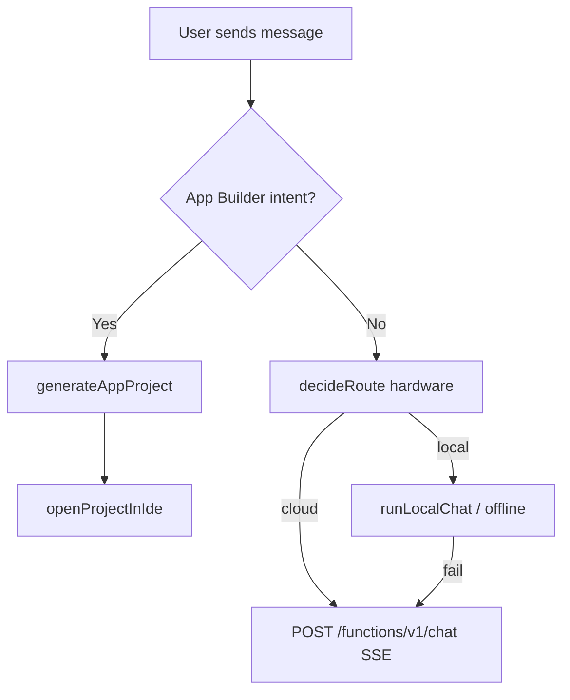
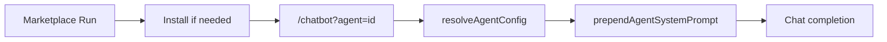

# Architecture reference

## Top-level application structure

```
/workspace
├── src/
│   ├── pages/           # Route-level screens (Chatbot, IDE, Marketplace, …)
│   ├── components/      # UI (chat/, ui/, monetization/, …)
│   ├── hooks/           # React hooks (marketplace, tools, offline, …)
│   ├── lib/             # Business logic (appBuilder, marketplace, offline, …)
│   └── integrations/    # Supabase client
├── supabase/
│   ├── functions/       # Edge functions (chat, web-search, …)
│   └── migrations/      # SQL schema + seeds
└── Detailed Documentation/   # This folder
```

## Primary routes

| Path | Page | Notes |
|------|------|-------|
| `/` | Landing | Marketing, metrics, stealth |
| `/chatbot` | ChatbotPage | Main AI chat; `?agent=` for marketplace |
| `/ide` | IdePage | PersonalIDE |
| `/marketplace` | MarketplacePage | Agents catalog + library |
| `/workspace` | WorkspacePage | Productivity hub |
| `/presentations` | PresentationBuilderPage | Slides generation |

## Data stores

| Store | Technology | Examples |
|-------|------------|----------|
| Auth & DB | Supabase | `conversations`, `messages`, `user_installed_agents` |
| Session | `sessionStorage` | IDE payload, active marketplace agent |
| Local | `localStorage` | Hardware profile, daily message count, offline prefs |

## Chat completion flow (simplified)



## Marketplace agent flow



## Key environment variables

| Variable | Purpose |
|----------|---------|
| `VITE_SUPABASE_URL` | API + functions base |
| `VITE_SUPABASE_PUBLISHABLE_KEY` | Anon key for client |

## Edge functions (chat ecosystem)

| Function | Role |
|----------|------|
| `chat` | Main LLM streaming |
| `web-search` | Live search tool |
| `generate-presentation` | Slides |
| `document-ai` | Documents |
| `shadow-agent-tools` | Agentic automations |
| `firecrawl-scrape` | Browser/scrape tool |

## Testing

- **Runner:** Vitest  
- **Patterns:** `*.test.ts` next to modules (`appBuilder`, `marketplace`, `hardwareIntelligence`, `webgpuRuntime`)

Run all:

```bash
npm test
```

Run subset:

```bash
npx vitest run src/lib/appBuilder
npx vitest run src/lib/marketplace
```

## Branch naming convention (cloud agents)

```
cursor/<descriptive-name>-7adb
```

Examples: `cursor/app-builder-7adb`, `cursor/marketplace-functional-7adb`.

## Extension points (future)

- Native mobile export (Capacitor/React Native) from App Builder projects.
- Marketplace user-published agents with admin review.
- Deeper WebGPU model catalog on turbo tier only.
