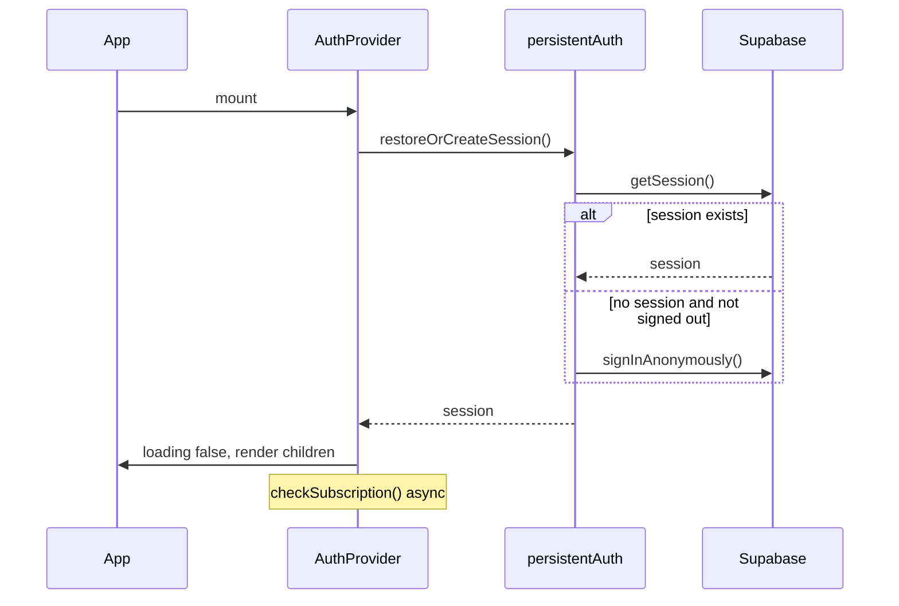

# UX, auth, and navigation (2026)

This document describes **how users enter ShadowTalk**, how **sessions work**, and recent **chat UI** changes. It complements [01-startup-performance.md](./01-startup-performance.md) and [08-architecture-reference.md](./08-architecture-reference.md).

---

## Default entry: workspace first

| URL | Behavior |
|-----|----------|
| `/` | Redirects to **`/chatbot`** (replace) |
| `/chatbot` | Primary AI workspace — chat, tools, sidebar |
| `/home` | Marketing landing (hero, features, pricing section, neural dock nav) |

**Rationale:** Returning users want the workspace, not a marketing splash. Marketing remains at `/home` for campaigns, SEO, and “Learn more” links.

**Code:** `src/App.tsx` (`Navigate to="/chatbot"`), footer/nav links updated to `/home#…` where appropriate.

---

## Boot and loading UX

Two loaders existed historically; behavior is now split:

| Loader | When shown | Current behavior |
|--------|------------|------------------|
| **Global `BootScreen`** | First visit per tab session (`shadowtalk-booted`) | **Skipped** on `/` and `/chatbot` via `shouldSkipBootScreen()` |
| **`ChatLoadingScreen`** | While `authLoading` or no user | **Removed** — chat shell renders immediately; auth runs in background |

**Files:**

- `src/components/BootScreen.tsx` — still used on marketing/legal routes on first visit
- `src/lib/skipBootScreen.ts` — path check for chat-first entry
- `src/pages/ChatbotPage.tsx` — no full-screen “Warming up…” gate
- `src/components/AuthProvider.tsx` — `loading` clears after session apply; subscription check is non-blocking

---

## Authentication (persistent / Gemini-style)

### Goals

- Open the site → **already in a session** (no forced `/auth` for chat).
- Session **persists** across tabs and revisits (Supabase `persistSession`).
- **Explicit sign-out** is remembered — no silent anonymous re-login until user signs in again.

### Flow

### Key modules

| Module | Role |
|--------|------|
| `src/lib/persistentAuth.ts` | `restoreOrCreateSession`, `SIGNED_OUT_FLAG`, return path memory |
| `src/components/AuthProvider.tsx` | Context: `user`, `session`, `loading`, `isAnonymous` |
| `src/components/PersistedAuthRedirect.tsx` | Signed-in (non-anonymous) users skip `/auth` |
| `src/components/WorkspacePathRemember.tsx` | Remembers last workspace path |
| `src/integrations/supabase/client.ts` | `storageKey: shadowtalk-auth` |

### Supabase dashboard requirement

Enable **Anonymous sign-ins** on the Supabase project so first-time visitors get a session without email.

### Sign out

`markExplicitSignOut()` sets `shadowtalk_signed_out` in `localStorage`. Until cleared by a real sign-in, anonymous auto-login does not run.

---

## Marketing landing (`/home`)

- **`LandingNavigation`** — dedicated header: Pricing, Install, Notifications, Feedback, Login (not full app `Navigation`).
- **Coupon banner** removed from home (was causing layout/runtime issues).
- **Motion** — `LandingInteractiveCard`, section reveals, magnetic buttons (`src/lib/landingMotion.ts`).

Pricing as a full experience: **`/pricing`** (`PricingPage`, `src/components/pricing/*`).

---

## Chat composer UI

**Layout:** `layout="composer"` on `ChatInput` (used from `ChatbotPage`).

| Element | Notes |
|---------|--------|
| Attach | Left, inside pill |
| Textarea | Center; padding reserves space for right actions |
| Provider chip | Sovereign / BYOK providers (`ProviderSelector`) |
| Voice | Opens ShadowTalk Live flow |
| Send | Gradient circle **inside** the pill (`shadowtalk-composer__actions`) |

**Removed from UI:** `HardwareTurboBadge` in input bar and toolbar. Hardware routing (`decideRoute`, `hardwareIntelligence`) still runs — see [03-hardware-turbo-routing.md](./03-hardware-turbo-routing.md).

**CSS:** `src/index.css` — `.shadowtalk-composer`, `__actions`, `__send`, `__textarea`.

---

## How to verify

1. Cold open `https://www.shadowtalk-ai.com/` → lands on chat **without** boot animation or “Warming up…”
2. Refresh `/chatbot` → session persists; sidebar shows user or guest initials
3. Sign out from profile → revisit → not auto-anonymous until sign-in (if flag set)
4. Open `/home` → marketing header only; link to `/chatbot` works
5. Composer: no Turbo chip; send button flush inside pill on mobile and desktop

---

## Related PRs / commits (main)

| Change | Reference |
|--------|-----------|
| Route `/` → chatbot, `/home` landing | `45cf4ac` |
| Persistent auth | `0e0b198` |
| Skip boot + remove chat loading gate | `4dd510a`, `50e714f` |
| Remove Turbo badge, fix send alignment | `877cc47` |
